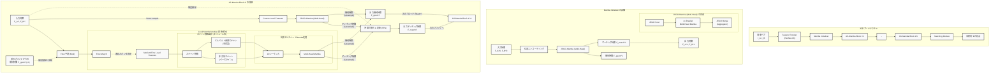

```mermaid
    graph TD
    %% 1. 全体パイプライン (Top-level Pipeline)
    subgraph "全体アーキテクチャ"
        A["画像ペア<br>I_A, I_B"] --> B["Feature Encoder<br>(ResNet-18)"];
        B --> C["Mamba Initializer"];
        C --> D["AS-Mamba Block #1"];
        D --> E["..."];
        E --> F["AS-Mamba Block #N"];
        F --> G["Matching Module"];
        G --> H["最終的な対応点"];
    end

    %% 2. Mamba Initializerの詳細
    subgraph "Mamba Initializer の詳細"
        Init_in["入力特徴<br>F_A^0, F_B^0"];
        PE["位置エンコーディング"];
        Init_in --> PE;
        
        MHM_Init["JEGO-Mamba (Multi-Head)"];
        PE --> MHM_Init;

        subgraph "JEGO-Mamba (Multi-Head) の内部"
            direction LR
            JegoScan_Init["JEGO Scan"] --> Mamba_Blocks_Init["4x Parallel<br>Multi-Head Mamba"];
            Mamba_Blocks_Init --> JegoMerge_Init["JEGO Merge<br>(Aggregator)"];
        end

        MHM_Init_Match_Out["マッチング特徴 F_match^1"];
        MHM_Init_Geom_Out["幾何特徴 F_geom^1"];
        
        MHM_Init --> MHM_Init_Match_Out;
        MHM_Init --> MHM_Init_Geom_Out;

        MHM_Init_Match_Out --> Init_out["出力特徴<br>F_A^1, F_B^1"];
    end


    %% 3. AS-Mambaブロックの詳細 (CORE)
    subgraph "AS-Mamba Block #i の詳細"
        F_in_i["入力特徴<br>F_A^i, F_B^i"];
        F_in_geom_prev["前のブロックからの<br>幾何特徴 F_geom^(i-1)"];

        KAN["Flow予測 (KAN)"];
        F_in_i --> KAN;
        F_in_geom_prev -.-> |幾何情報を補助| KAN;
        FlowMap["Flow Map Φ"];
        KAN --> FlowMap;
        
        %% Global Path
        GM_in["Coarse Level Features"];
        F_in_i --> |Down-sample| GM_in;
        GM_Mamba["JEGO-Mamba (Multi-Head)"];
        GM_in --> GM_Mamba;
        
        %% Local Paths (Medium & Fine)
        subgraph "Local Mamba Module (革新部分)"
            Local_Input["Medium/Fine Level Features"];
            subgraph "スキャン戦略選択 (モジュール性)"
                direction LR
                Scan_Choice["スキャン戦略"];
                Scan_Choice --> Scan_Multi["多方向スキャン<br>(ベースライン)"];
                Scan_Choice --> Scan_Hilbert["ヒルベルト曲線スキャン<br>(本命案)"];
            end
            Local_Input --> Scan_Choice;
            
            subgraph "局所マルチヘッドMamba処理"
                direction LR
                Scanned_Seq["1Dシーケンス"] --> MHM_Local["Multi-Head Mamba"];
            end

            Scan_Multi --> Scanned_Seq;
            Scan_Hilbert --> Scanned_Seq;
            
            FlowMap -.-> |適応スパンを決定| Local_Input;
        end

        %% Fusion and Update
        Fusion["特徴の集約 & 更新 (FFN)"];
        
        GM_Mamba -- "マッチング特徴<br>(Upsample)" --> Fusion;
        MHM_Local -- "マッチング特徴<br>(Upsample)" --> Fusion;
        
        F_in_i -.-> |残差接続| Fusion;

        F_out_match["出力マッチング特徴<br>F_match^i"];
        F_out_geom["出力幾何特徴<br>F_geom^i"];
        
        Fusion --> F_out_match;
        GM_Mamba -- "幾何特徴<br>(Upsample)" --> F_out_geom;
        MHM_Local -- "幾何特徴<br>(Upsample)" --> F_out_geom;
        
        F_out_match --> |次のブロックへ| Next_Block["AS-Mamba Block #i+1"];
        F_out_geom --> |次のブロックのKANへ| Next_Block;
    end
    
    %% スタイリング
    classDef block fill:#f9f9f9,stroke:#333,stroke-width:2px;
    class A,B,C,D,E,F,G,H,Init_in,PE,MHM_Init,MHM_Init_Match_Out,MHM_Init_Geom_Out,Init_out,JegoScan_Init,Mamba_Blocks_Init,JegoMerge_Init,F_in_i,F_in_geom_prev,KAN,FlowMap,GM_in,GM_Mamba,Local_Input,Scan_Choice,Scan_Multi,Scan_Hilbert,Scanned_Seq,MHM_Local,Fusion,F_out_match,F_out_geom,Next_Block block;
```